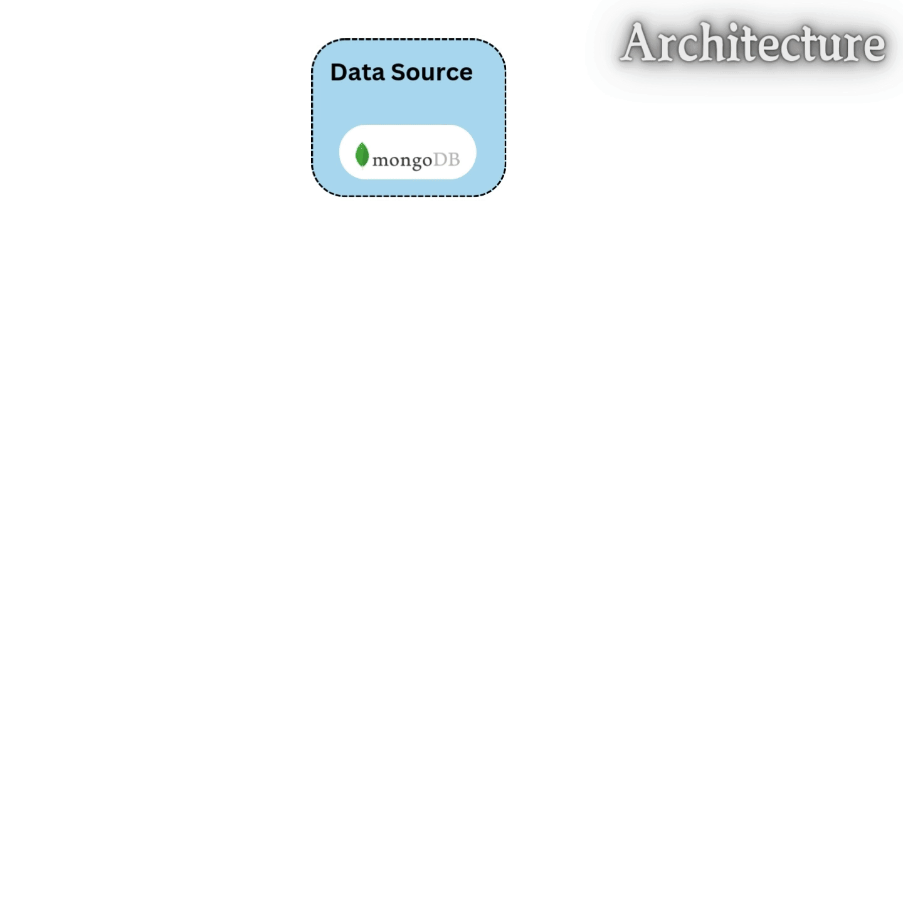
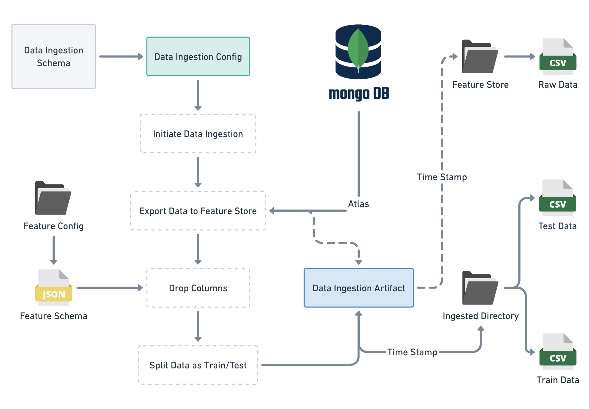
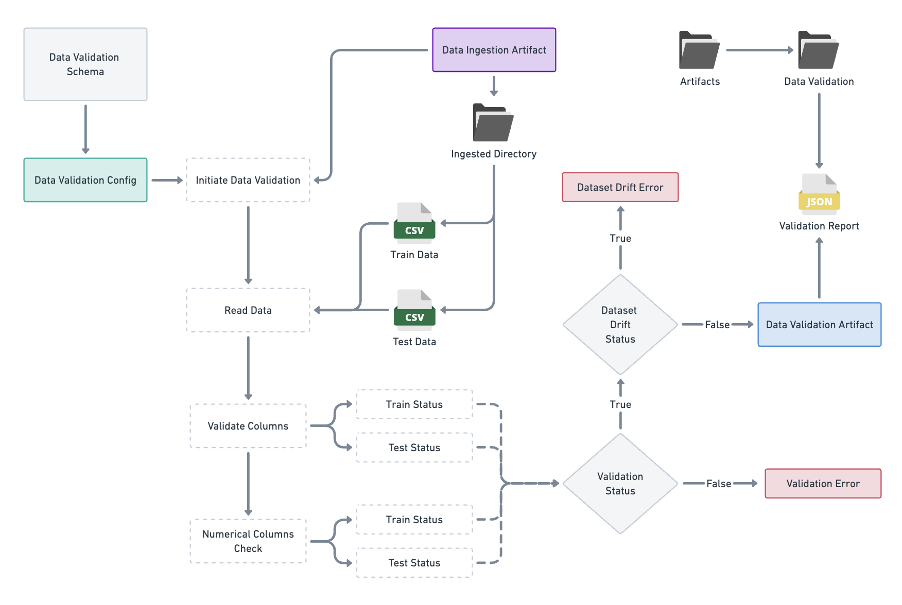
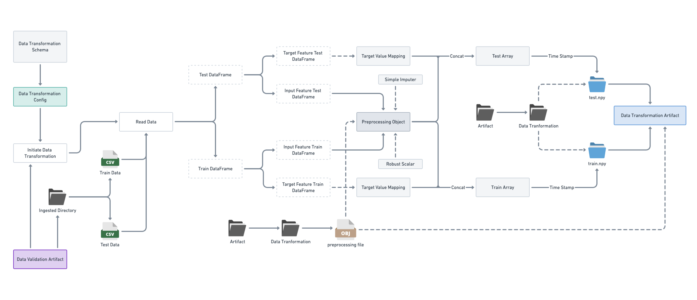
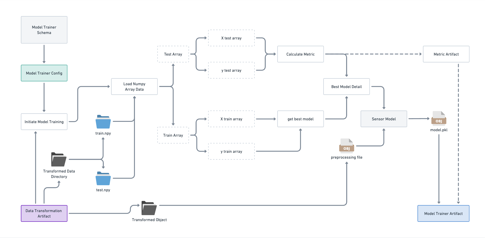
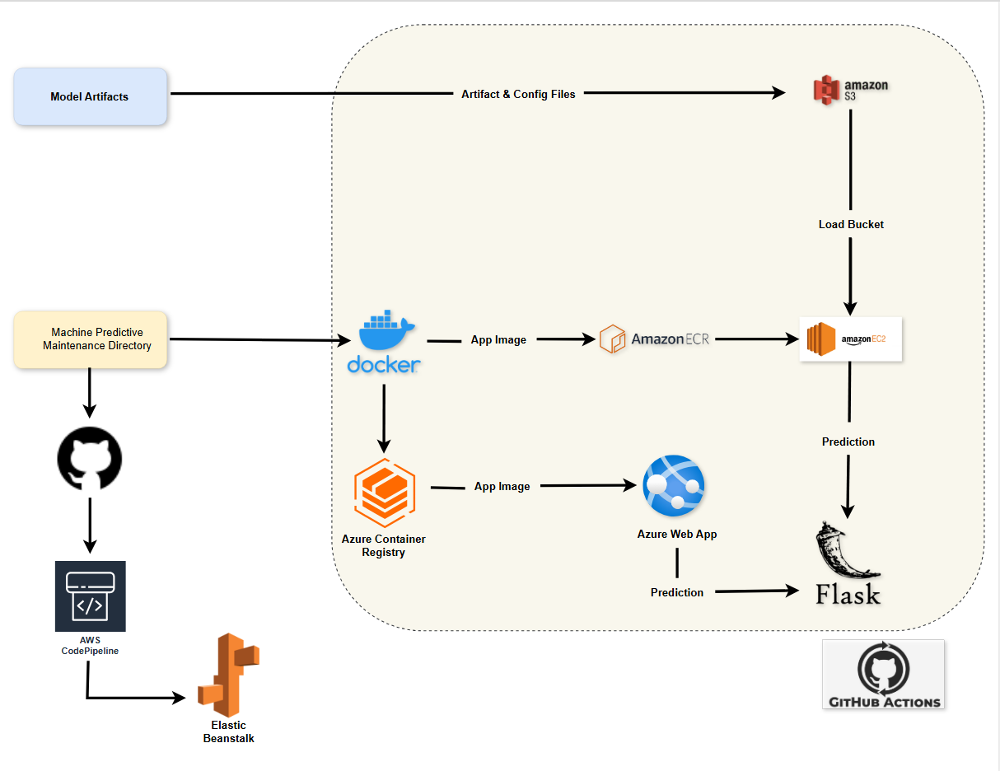

<div align="center">
    <h1>MLOps Solution for Machine Predictive Maintenance</h1>

</div>

## Table of Contents
1. [Problem Statement](#-problem-statement)
2. [Goals Achieved](#-goals-achieved)
3. [Project Methodology](#%EF%B8%8F-project-methodology)
   - [Data Ingestion](#data-ingestion)
   - [Data Validation](#data-validation)
   - [Data Transformation](#data-transformation)
   - [Model Building & Testing](#model-building--testing)
   - [Deployment Pipeline](#deployment-pipeline)

## Problem Statement
This project performs machine predictive maintenance by classifying whether a machine will fail or not, and if a failure occurs, predicting the type of failure, such as Heat Dissipation Failure, Power Failure, Overstrain Failure, Tool Wear Failure, Random Failures, or No Failure if the machine does not fail. It helps businesses anticipate maintenance needs, optimize operations, and improve overall efficiency.

## Features
Key features in the dataset include:
| **Feature Name**           | **Description**                                                                 |
|----------------------------|-------------------------------------------------------------------------------|
| `UDI`                      | unique identifier ranging from 1 to 10000.                      |
| `Product ID`               | A unique identifier for each product, consisting of a letter (L, M, H) for quality (Low, Medium, High) followed by a serial number. |
| `type`                     | consisting of a letter L, M, or H for low (50% of all products), medium (30%), and high (20%) as product quality variants and a variant-specific serial number. |
| `air temperature`          | generated using a random walk process later normalized to a standard deviation of 2 K around 300 K. |
| `process temperature`      | generated using a random walk process normalized to a standard deviation of 1 K, added to the air temperature plus 10 K.               |
| `rotational speed`         | calculated from power of 2860 W, overlaid with a normally distributed noise.                         |
| `torque`              | torque values are normally distributed around 40 Nm with an σ = 10 Nm and no negative values.                          |
| `tool wear`          | The quality variants H/M/L add 5/3/2 minutes of tool wear to the used tool in the process.       |
| `Target`                   | Failure or Not.                                           |
| `Failure Type`             | 'machine failure' label that indicates, whether the machine has failed in this particular data point for any of the following failure modes are true.                                      |


## Goals Achieved
- Developed a comprehensive pipeline for data ingestion, validation, transformation, and model training.
- Implemented a machine learning model capable of predicting machine failure and the type of failure with high accuracy.
- Established a deployment pipeline to facilitate continuous integration and continuous delivery/deployment of the model.

## Project Methodology

### Data Ingestion
The project begins with data ingestion, where data is collected from a MongoDB database. The data is then exported into a structured format for further processing.


### Data Validation
Once the data is ingested, it undergoes validation to ensure its quality and integrity. This step checks for schema conformity, and potential dataset drift.


### Data Transformation
After validation, the data is transformed to prepare it for modeling. This includes handling missing values, feature scaling, and encoding categorical variables.


### Model Training & Evaluation 
The core of the project involves training and evaluating various machine learning models. The best-performing model is selected based on evaluation metrics such as f1-score.


### Deployment Pipeline
The trained model is served using Flask and containerized with Docker. The Docker image is pushed to **Amazon ECR** for deployment on an **EC2 instance** and to **Azure Container Registry (ACR)** for deployment on an **Azure Web App**. Additionally, the app (non-Dockerized) is deployed to **AWS Elastic Beanstalk**, showcasing multiple deployment methods across cloud platforms. A **CI/CD pipeline using GitHub Actions** automates the deployment process, ensuring seamless updates as new data or model versions become available.


---

## Getting Started
### Prerequisites
- Docker
- Python 3.8+
- Cloud account (AWS/Azure)
- GitHub Actions

### Installation
1. Clone the repository:
   ```bash
   git clone https://github.com/roshankahaneDSAI/Predictive-Maintenance-ML-System.git
   cd machine-predictive-maintenance-mlops
